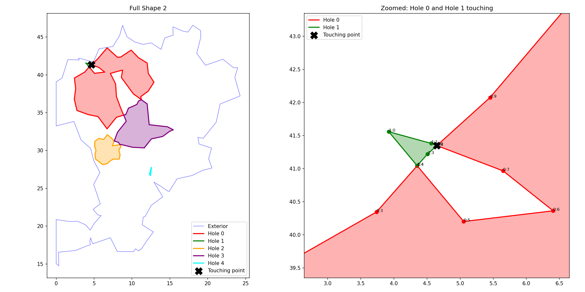
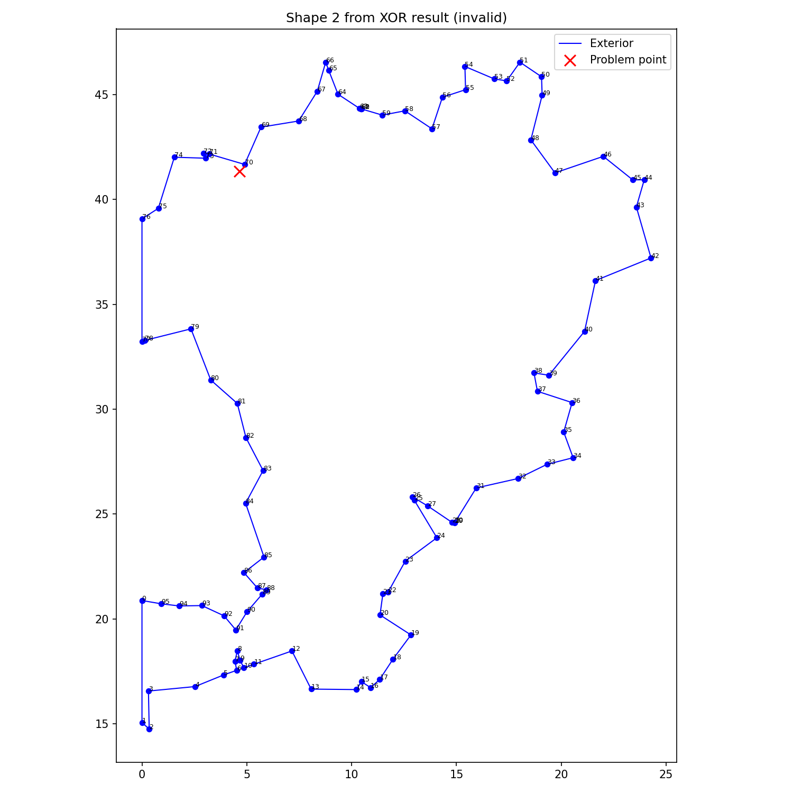

# OGC Validity Differences in iOverlay Results

This document explains an important difference between the geometric output of iOverlay
and the OGC Simple Feature Specification (SFS) that libraries like Shapely use for validation.

## The Issue

When running fuzzer tests against the i_overlay library, certain operations produce geometries
that Shapely reports as invalid with errors like:

```
Invalid geometry: Interior is disconnected[4.64885824918747 41.3479019403458]
```

However, testing the same inputs directly against the raw Rust i_overlay implementation
shows that **all operations succeed**. This raises the question: is this a bug in the
bindings, in the upstream library, or something else entirely?

## Root Cause Analysis

The "invalid" geometries are **mathematically correct** results of the boolean operations.
The issue is that they violate OGC's stricter definition of polygon validity.

### Example: Touching Holes

Consider a polygon with multiple holes. After a boolean XOR operation, two holes may share
exactly two vertices:



In this example:
- **Hole 0** (red) and **Hole 1** (green) share exactly two vertices
- The touching points are at:
  - `(4.352206826210022, 41.04278254508972)`
  - `(4.64885824918747, 41.347901940345764)` (the reported problem point)

### Why This Violates OGC

The OGC Simple Feature Specification requires that:

1. **Polygon interiors must be connected** - you should be able to travel between any two
   points in the interior without crossing a boundary
2. **Holes can only touch the exterior or other holes at a single point** - touching at
   two or more points creates a "pinched" configuration

When two holes share two vertices, they create a narrow corridor between them that
effectively "pinches" the polygon's interior, making it topologically disconnected.

### The Full Picture

Looking at the full shape helps understand the geometry:



The polygon has:
- 96 points in the exterior ring
- 5 holes with varying complexity
- Multiple pairs of holes that touch at exactly 2 points

## Why This Happens

iOverlay computes boolean operations using an algorithm that produces geometrically
correct results. However, it does not enforce OGC's stricter topological constraints
about how holes may interact.

This is a **design choice**, not a bug:
- The mathematical result is correct
- The total area is preserved
- All points are in the correct locations

## Implications for Users

### When This Matters

If you're using the results with:
- **Shapely** - geometries may be flagged as invalid
- **PostGIS** - ST_IsValid will return false
- **GEOS** - validity checks will fail
- **GeoJSON validators** - strict validators may reject the output

### When This Doesn't Matter

If you're using the results for:
- **Rendering** - the shapes will display correctly
- **Area calculations** - the area is mathematically correct
- **Further boolean operations in iOverlay** - will work fine
- **Non-OGC systems** - many systems don't enforce these constraints

## Workarounds

### Using Shapely's make_valid

```python
from shapely.validation import make_valid

# Result from iOverlay
result = overlay(subject, clip, OverlayRule.Xor, FillRule.EvenOdd)

# Convert to Shapely
multi = shapes_to_shapely(result)

# If invalid, make it valid
if not multi.is_valid:
    multi = make_valid(multi)  # Splits into multiple polygons
```

The `make_valid` function will:
- Split the polygon at the touching points
- Return a `MultiPolygon` with multiple valid polygons
- Preserve the total area

In our example:
- Original: 1 invalid polygon (area = 334.09)
- After make_valid: 4 valid polygons (total area = 334.09)

### Post-Processing in iOverlay

A potential future enhancement would be to add an option to split touching holes
during the overlay operation itself.

## Conclusion

The differences between iOverlay's output and OGC validity are:

1. **Not bugs** - the mathematical results are correct
2. **Design decisions** - iOverlay prioritizes geometric correctness over OGC compliance
3. **Manageable** - can be fixed with post-processing if OGC compliance is required

When using this library, be aware that:
- Results may need validation/repair for OGC-compliant systems
- The raw results are geometrically sound
- The Rust implementation produces identical results (this is not a Python binding issue)
