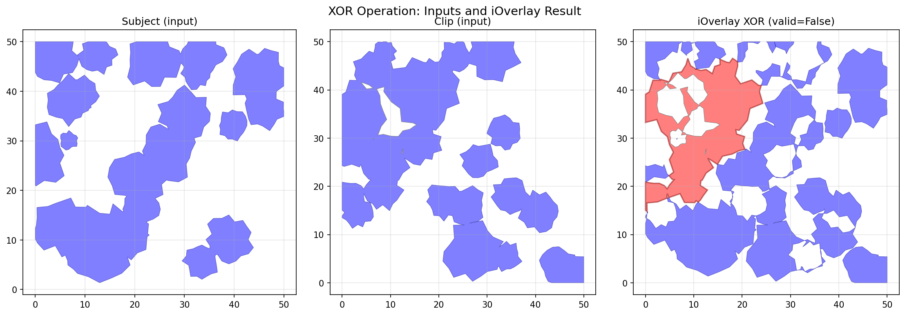
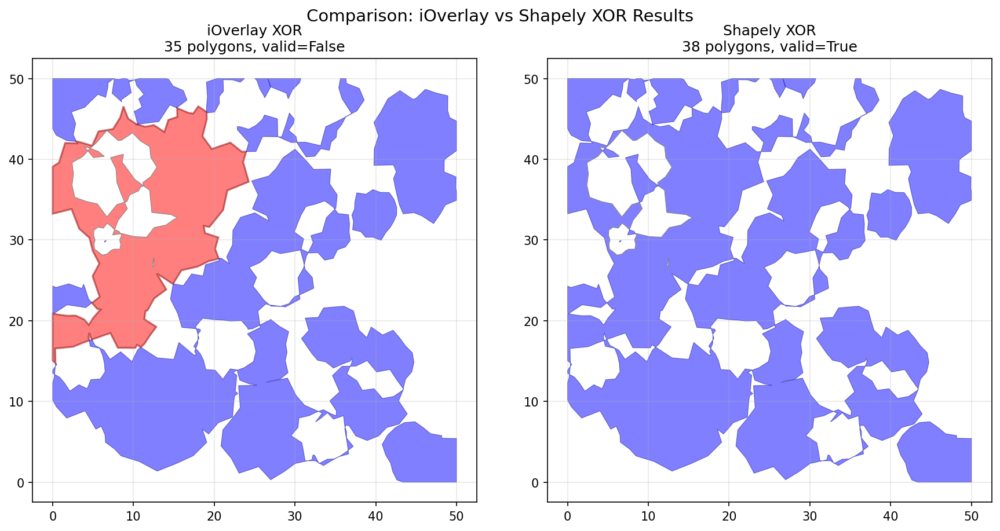
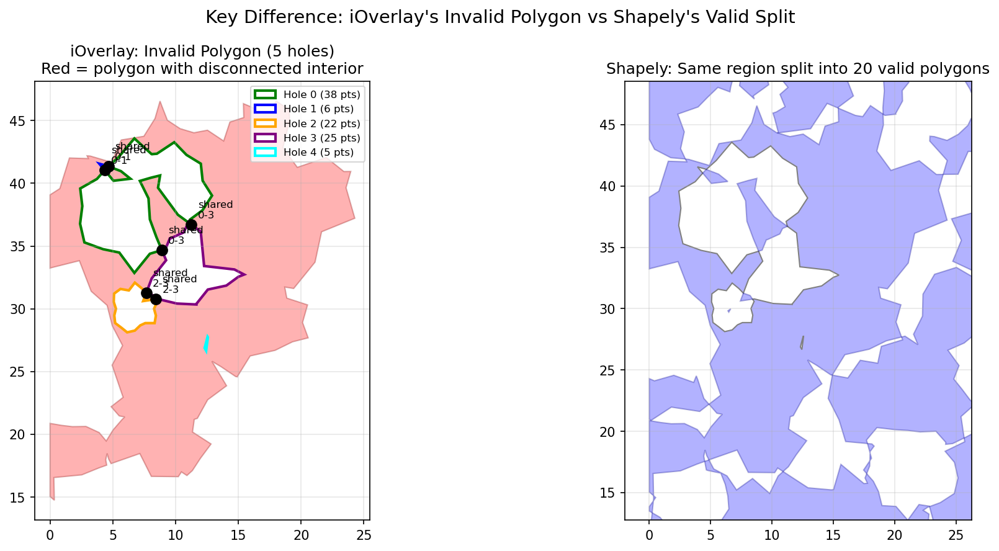

# OGC Validity Issue in iOverlay Results

This document describes an issue where iOverlay produces geometries that violate
OGC Simple Feature Specification validity rules. This is a reproducible bug report
intended for the iOverlay maintainers.

## Summary

When performing certain boolean operations (particularly XOR), iOverlay produces
polygons where interior holes share two or more vertices. This creates geometries
with disconnected interiors, violating the OGC requirement that polygon interiors
must be connected point sets.

**Key finding**: Shapely/GEOS produces OGC-valid output for the same operation,
proving that valid output is achievable.

## Reproducing the Issue

### Step 1: Generate the test case

```bash
# From the pyOverlay repository root:
python -m tests._fuzzer --generator spots --seed 12 --output-dir docs
```

This creates `docs/fuzzer-spots-12.json` containing the subject and clip shapes.

### Step 2: Run the analysis script

```bash
python docs/analyze_validity.py
```

This script:
1. Loads the test case from JSON
2. Performs XOR with both iOverlay and Shapely
3. Compares validity and structure of results
4. Generates visualization images

## Results Comparison

| Metric | iOverlay | Shapely |
|--------|----------|---------|
| Operation | XOR (EvenOdd) | symmetric_difference |
| Output polygons | 35 | 38 |
| Invalid polygons | 1 | 0 |
| Total area | 1305.275954 | 1305.275954 |

Both produce the same total area, but iOverlay has one invalid polygon while
Shapely produces all valid polygons.

## The Invalid Polygon

iOverlay's polygon at index 2 has:
- 97 exterior points
- 5 holes
- Area: 334.085478

The validity issue: **Interior is disconnected**

### Holes Sharing Vertices

The invalid polygon has three pairs of holes that share 2 vertices each:

| Holes | Shared Points |
|-------|---------------|
| 0 and 1 | (4.352207, 41.042783), (4.648858, 41.347902) |
| 0 and 3 | (8.906744, 34.676220), (11.254274, 36.706401) |
| 2 and 3 | (7.663793, 31.262938), (8.419574, 30.768476) |

When two holes share 2+ vertices, they create a "corridor" that disconnects
the polygon's interior.

## OGC Specification Reference

The OGC Simple Feature Specification (ISO 19125-1) states:

> "The interior of every Surface is a connected point set."

This is not an arbitrary "stricter definition" - it's a fundamental topological
requirement for polygon validity. A polygon with disconnected interior cannot
be properly processed by most GIS operations.

### Valid vs Invalid Hole Configurations

**VALID**: Holes sharing ONE vertex (interior remains connected)
```
  ┌─────────────┐
  │  ┌───┐      │
  │  │ ░ │      │   ● = single shared vertex -- interior remains connected
  │  └───●───┐  │   ░ = holes
  │      │ ░ │  │
  │      └───┘  │
  └─────────────┘
```

**INVALID**: Holes sharing TWO vertices (disconnects interior)
```
  0   1   2   3   4   5
5 ┌───────────────────┐
  │                   │
4 │   ┌───────┐       │
  │   │ ░   ░ │       │   Two L-shaped holes share vertices ● at (2,2) and (3,3)
3 │   │   ┌───●───┐   │
  │   │ ░ │   │ ░ │   │   ░ = holes
2 │   └───●───┘   │   │
  │       │ ░   ░ │   │   The shared diagonal edge disconnects the interior
1 │       └───────┘   │
  │                   │
0 └───────────────────┘
```

## Visual Comparison

### Overview


### iOverlay vs Shapely Results


### Invalid Polygon Detail


## Python Code to Reproduce

```python
import json
from shapely.geometry import Polygon, MultiPolygon
from shapely.validation import explain_validity
from i_overlay import FillRule, OverlayRule, overlay

# Load test case
with open("docs/fuzzer-spots-12.json") as f:
    data = json.load(f)

def convert_shapes(shapes):
    """Convert JSON lists to tuples for i_overlay."""
    return [[[tuple(pt) for pt in contour] for contour in shape] for shape in shapes]

def shapes_to_shapely(shapes):
    """Convert i_overlay shapes to Shapely MultiPolygon."""
    polygons = []
    for shape in shapes:
        if not shape:
            continue
        exterior = list(shape[0])
        if exterior[0] != exterior[-1]:
            exterior = exterior + [exterior[0]]
        holes = []
        for hole in shape[1:]:
            if len(hole) >= 3:
                h = list(hole) if hole[0] == hole[-1] else list(hole) + [hole[0]]
                holes.append(h)
        try:
            poly = Polygon(exterior, holes or None)
            if not poly.is_empty:
                polygons.append(poly)
        except Exception:
            pass
    return MultiPolygon(polygons) if polygons else MultiPolygon()

subject = convert_shapes(data["subject"])
clip = convert_shapes(data["clip"])

# iOverlay XOR
ioverlay_result = overlay(subject, clip, OverlayRule.Xor, FillRule.EvenOdd)
ioverlay_mp = shapes_to_shapely(ioverlay_result)

# Shapely XOR
subject_mp = shapes_to_shapely(subject)
clip_mp = shapes_to_shapely(clip)
shapely_result = subject_mp.symmetric_difference(clip_mp)

# Compare
print(f"iOverlay: {len(ioverlay_mp.geoms)} polygons, valid={ioverlay_mp.is_valid}")
print(f"Shapely:  {len(shapely_result.geoms)} polygons, valid={shapely_result.is_valid}")
print(f"Area difference: {abs(ioverlay_mp.area - shapely_result.area):.10f}")

if not ioverlay_mp.is_valid:
    print(f"iOverlay validity issue: {explain_validity(ioverlay_mp)}")

# Find the invalid polygon
for i, poly in enumerate(ioverlay_mp.geoms):
    if not poly.is_valid:
        print(f"\nInvalid polygon {i}: {len(poly.interiors)} holes")

        # Check for shared vertices between holes
        for j, hole1 in enumerate(poly.interiors):
            for k, hole2 in enumerate(poly.interiors):
                if j >= k:
                    continue
                h1 = set(tuple(round(c, 10) for c in pt) for pt in hole1.coords)
                h2 = set(tuple(round(c, 10) for c in pt) for pt in hole2.coords)
                shared = h1 & h2
                if len(shared) >= 2:
                    print(f"  Holes {j} and {k} share {len(shared)} vertices!")
```

## Expected Behavior

Shapely/GEOS handles this case by splitting the polygon at the pinch points,
producing multiple valid polygons instead of one invalid polygon:

- iOverlay: 1 polygon with 5 holes (invalid)
- Shapely equivalent: 4 polygons with 0-2 holes each (all valid)

The total area is preserved in both cases.

## Suggested Fix

iOverlay should detect when holes share 2+ vertices and split the polygon
at those points into multiple valid polygons, similar to how Shapely/GEOS
handles this case.

### Potential Implementation

iOverlay already has a `ContourDecomposition` trait in `core::divide` that can split
self-intersecting contours at their crossing points. This could potentially be applied
to the exterior boundary of polygons with problematic hole configurations.

When holes share 2+ vertices, the polygon's "effective boundary" (exterior minus holes)
has self-touching points. Applying contour decomposition logic to detect and split at
these points would produce multiple valid polygons.

## Impact

Users passing iOverlay results to OGC-compliant systems will experience:
- PostGIS: `ST_IsValid()` returns false
- Shapely: Various operations may fail or produce incorrect results
- QGIS: Geometry validation errors
- GeoJSON validators: Rejection of output

## Workaround

Until this is fixed in iOverlay, users can apply Shapely's `make_valid()`:

```python
from shapely.validation import make_valid

result = overlay(subject, clip, OverlayRule.Xor, FillRule.EvenOdd)
result_mp = shapes_to_shapely(result)

if not result_mp.is_valid:
    result_mp = make_valid(result_mp)  # Splits into valid polygons
```

## Environment

- iOverlay version: 4.1
- Shapely version: 2.x (GEOS 3.x)
- Python version: 3.13

## Files

- `fuzzer-spots-12.json` - Test case input data
- `analyze_validity.py` - Analysis and visualization script
- `comparison_overview.png` - Overview visualization
- `ioverlay_vs_shapely.png` - Side-by-side comparison
- `invalid_polygon_detail.png` - Detailed view of the invalid polygon
